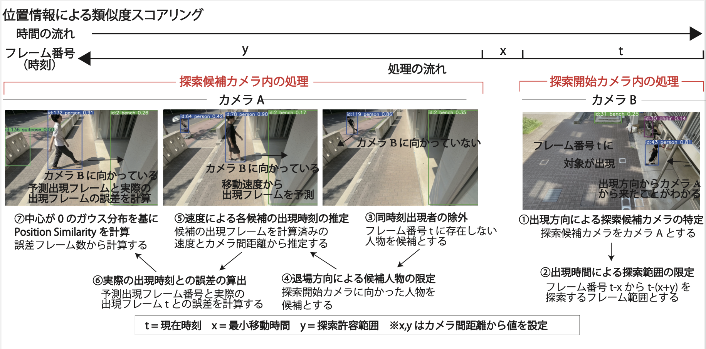
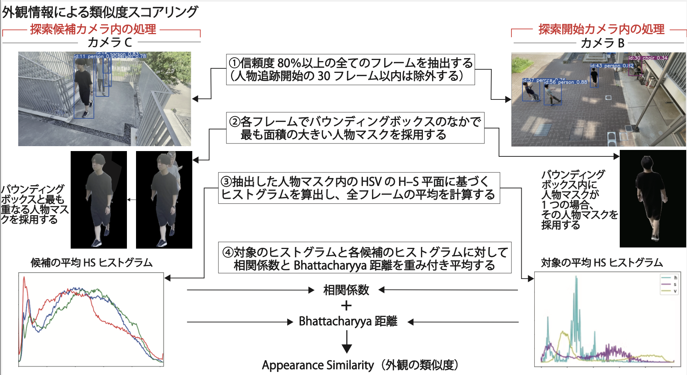

# MCT-BKC: マルチカメラトラッキングによるリアルタイム人物再同定

## 1. はじめに

### 1.1 研究背景

近年、人物追跡技術は多様な分野で重要性を増しています。特に、複数のカメラを用いた広範囲な監視は、以下の場面で不可欠です：
- **災害時の避難支援**：施設内での避難状況をリアルタイムで把握
- **小売業**：顧客の動線分析を通じて、購買体験を向上させる
- **安全・セキュリティ分野**：不審者や要注意人物の追跡

これらの技術は**マルチカメラトラッキング (MCT)** を使用して実現され、様々な業界で急速に導入が進んでいます。

### 1.2 既往研究と本研究の位置付け

従来のマルチカメラトラッキング技術は、各カメラでの人物位置を共通の平面に投影し、位置情報を元に人物を識別する方法が主流でした。しかし、この方法には視野が重なる必要があり、カメラの設置場所に制約が生じる問題があります。
そのため、近年では、視野が重ならない環境でも有効なトラッキング手法が求められています。特に、顔認識や外観特徴の抽出を活用する方法が注目されています。しかし、カメラからの距離が遠い場合や、顔情報が欠落している場合、精度が低下する課題が残っています。
本研究では、視野が重ならないマルチカメラ環境でのトラッキング精度を向上させるために、位置情報と外観情報を統合し、ID統合を行う多段階アプローチを提案しています。

## 2. 研究方法

### 2.1 概要

本研究では、**iPhone12** を5台使用し、同時刻に**3分間**の映像を撮影しました。撮影された映像に対して、**YOLOv8** と **BoT-SORT** を用いて人物の追跡を行い、その後、ID統合に必要な情報を抽出します。

- **位置情報に基づく類似度**：位置情報に基づいて算出
- **外観情報に基づく類似度**：外観特徴に基づいて算出
- これらの類似度を加重平均して最終的な **Fusion Similarity** を得ます。もしこの **Fusion Similarity** が閾値を超えれば、同一人物として判断し、ID統合を行います。

### 2.2 位置情報による類似度スコアリング

位置情報に基づく類似度スコアリングは、以下の段階で行います：

1. **出現方向による探索候補カメラの特定**：人物がどのカメラから移動してきたかを推定
2. **出現時刻に基づく探索範囲の限定**：候補カメラ内での探索範囲を絞り込み
3. **退場方向による候補人物の限定**：探索開始カメラに向かった人物を絞り込む
4. **速度による予測出現時刻の推定**：移動速度に基づいて、予測される出現フレームを計算
5. **出現フレームとの誤差計算**：予測と実際のフレームとの差を算出し、時間的な誤差を評価

これにより、個別の移動特性を考慮した時間一致度を定量的に評価でき、人物同定精度を向上させます。

### 2.3 外観情報による類似度スコアリング

外観情報の類似度スコアリングは以下の流れで行います：

1. **信頼度が80%以上のフレームを抽出**：信頼度80%以上のフレームを信頼できるフレームとして選択
2. **HSV色空間に基づく2次元ヒストグラムを算出**：人物のマスクを使って2次元ヒストグラムを計算
3. **相関係数とBhattacharyya距離で類似度を評価**：ヒストグラムの比較を行い、類似度を算出

この手法により、照度変動の影響を低減し、外観の特徴を安定的に評価します。

### 2.4 多段階統合

位置情報と外観情報で算出された類似度を統合し、最終的に人物IDの統合を行います。統合は、位置情報と外観情報に対して信頼度に応じた重みを与え、加重平均によって**Fusion Similarity**を算出します。

最終的に、**Fusion Similarity**が閾値を超える場合、同一人物と判断し、ID統合を行います。

