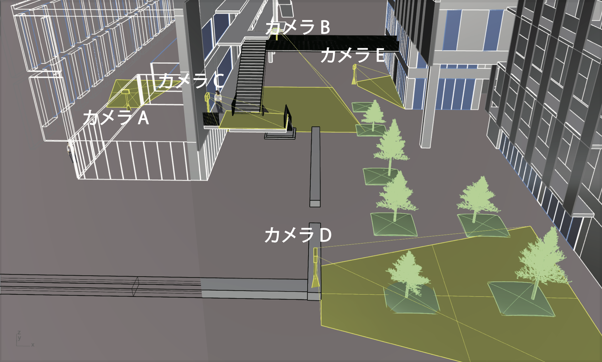
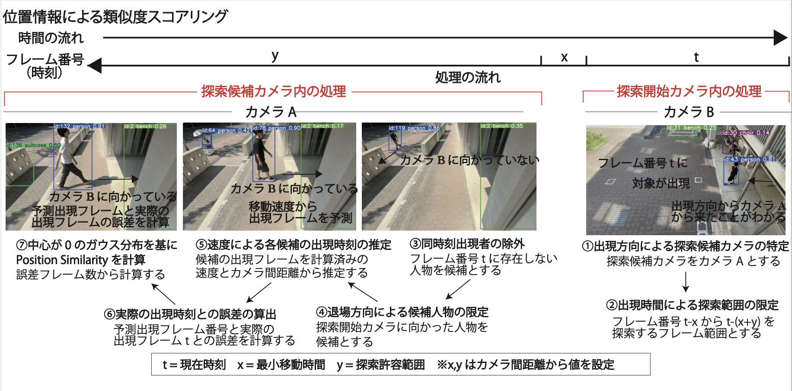
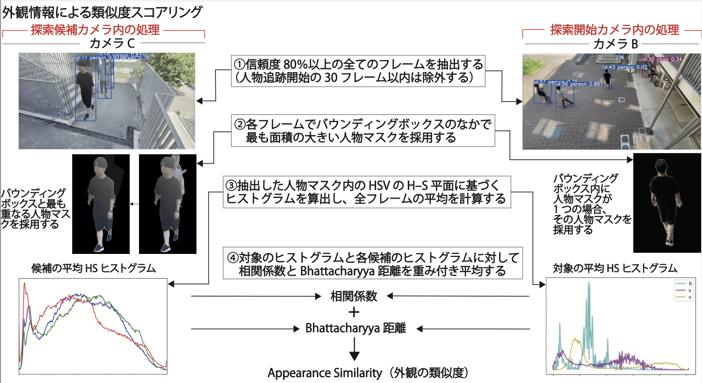

# MCT-BKC: 非オーバーラップのマルチカメラトラッキングによる人物再同定

## 1. はじめに

### 1.1 研究背景

近年、人物追跡技術は多様な分野で重要性を増しています。特に、複数のカメラを用いた広範囲な監視は、以下の場面で不可欠です：
- **災害時の避難支援**：施設内での避難状況をリアルタイムで把握
- **小売業**：顧客の動線分析を通じて、購買体験を向上させる
- **安全・セキュリティ分野**：不審者や要注意人物の追跡

これらの技術は**マルチカメラトラッキング (MCT)** を使用して実現され、様々な業界で急速に導入が進んでいます。

### 1.2 既往研究と本研究の位置付け

本研究は、個人で完結する理論検証に留まらず、「実環境で使えるマルチカメラ追跡を、1 回の実行で最後まで処理できる形にする」ことを強く意識して設計しています。担当は全て自分一人で、要件整理からアルゴリズム設計、実装、評価・デバッグ、運用を想定した入出力設計までを一貫して行っています。対象規模としては、ある施設の 1 フロアを想定し、5 台のカメラ（各カメラ間距離はおよそ 5m〜15m）で撮影された映像から得られるトラッキング結果を入力として、カメラをまたいだ人物 ID を統合します。

従来の「カメラ同士が重なる（オーバーラップ）」環境であれば、複数カメラの画像を同一平面に投影し、位置の一致によって同一人物を照合できます。しかし、この方法はカメラの設置条件や台数に制約があり、現実の監視カメラのように配置が自由でない環境では適用が困難です。非オーバーラップ下で継続的な追跡が可能になれば、既存の監視カメラ網にそのまま適用でき、運用面で大きな利点があります。この実用性の高さが本研究の着眼点です。

はじめは顔認証の利用も検討しましたが、広角カメラでは顔が小さく写ったり欠損したりすることが多く、安定した識別が難しいことが分かりました。また、プライバシー面の懸念から社会実装が難しい点も明らかでした。そこで現在主流となっているのが、人物画像を深層学習モデルに入力し、出力される特徴ベクトル同士の類似度を用いて人物を再識別する手法です。既往研究では、より多くの特徴を取り込むために複雑な CNN アーキテクチャや Attention 機構を組み合わせ、外観を多層的に学習するモデルが多数提案されています。一方で、そのような大規模モデルに強く依存すると、学習データや運用環境への依存が大きくなり、現場での説明性や運用のしやすさが課題になります。

本研究ではこの既往研究の流れを踏まえつつ、外観特徴だけで強引に一致させるのではなく、「その人物が物理的にそこへ到達し得るか」を明示的にモデル化して候補を絞り、外観比較は軽量・説明可能な手法で安定化させる、という方針で設計しています。具体的には、二つの独自の工夫を中核に置いています。

## 2. 研究方法

### 2.1 概要

本研究では、**iPhone12** を5台使用し、同時刻に**3分間**の映像を撮影しました。撮影された映像に対して、**YOLOv8** と **BoT-SORT** を用いて人物の追跡を行い、その後、ID統合に必要な情報を抽出します。

- **位置情報に基づく類似度**：位置情報に基づいて算出
- **外観情報に基づく類似度**：外観特徴に基づいて算出
- これらの類似度を加重平均して最終的な **Fusion Similarity** を得ます。もしこの **Fusion Similarity** が閾値を超えれば、同一人物として判断し、ID統合を行います。

### 2.2 位置情報による類似度スコアリング

一つ目は、人物固有の移動特性を時間方向に沿ってモデル化し、ID 統合に活用した点です。従来は平均移動時間や単純な時刻差に頼る手法が主流でしたが、本研究では各トラックから移動方向と速度を推定し、カメラ間距離と組み合わせることで「到達しうる時刻」を予測します。ここで重要なのは、単に「予測時刻＝平均との差」ではなく、トラック末尾の速度を推定し、カメラ間距離を速度で割って移動時間を見積もることで、個人差を反映する点です。さらに、予測時刻と実際の出現時刻の差をフレーム差 ΔF として扱い、ガウス分布に基づく類似度（時刻尤度）としてスコア化します。これにより、外観が似ている別人であっても「時間的に物理到達が不整合な候補」を強く抑制でき、結果として追跡の安定性が上がります。現場の監視カメラに近い環境では、外観の似た人物（黒い服・制服・作業着など）が出やすく、外観だけでの統合は誤対応を起こしやすいため、物理制約をスコアに組み込む設計は特に効果が大きいと考えています。

### 2.3 外観情報による類似度スコアリング

二つ目は、深層学習に過度に依存せず、HS ヒストグラムを用いた軽量で説明可能な外観比較を実現した点です。RGB の明るさ成分はカメラ間の照度差や露出差の影響を強く受けるため、本研究では色相 H と彩度 S を用い、明度成分を除外することで環境依存性を抑えています。さらに、単一フレームの外観ではノイズが大きいため、複数フレームに渡ってヒストグラムを平均し、安定したトラック単位の外観表現を得るようにしています。その際も、検出信頼度が一定以上のフレームのみを採用し、誤検出が混入した外観特徴が平均に混ざらないようにしています。類似度指標としては、相関係数（分布形状の一致）と Bhattacharyya 距離（分布間距離）を併用し、両者を加重平均することで、分布の一致・不一致を直感的に説明できるスコアにしています。結果として、計算量を抑えつつ、カメラ間の照度差・ノイズに対して頑健な外観比較を実現しています。

### 2.4 多段階統合

位置情報と外観情報で算出された類似度を統合し、最終的に人物IDの統合を行います。統合は、位置情報と外観情報に対して信頼度に応じた重みを与え、加重平均によって**Fusion Similarity**を算出します。

最終的に、**Fusion Similarity**が閾値を超える場合、同一人物と判断し、ID統合を行います。

## 3. システムの説明
---

### 3.1 想定スコープ（規模・入力・出力）

**規模**
- 施設 1 フロアを想定
- カメラ 5 台（例：iPhone12 ×5）
- カメラ間距離：5m〜15m 程度
- 同時刻に撮影した映像（例：3分）からトラッキングを実施し、その結果を統合

**入力**
- 各カメラ独立の人物トラッキング結果（JSON）
  - track_id（カメラ内ID）
  - frame_idx
  - center_bottom（画像座標）
  - conf（検出信頼度）
  - bbox（bounding box）
  - hs_hist（外観特徴量）

**出力**
- TrackSummary（トラック要約：開始・終了・方向・速度・外観）
- マッチスコア（位置・外観・融合）

---

### 3.2 設計思想（要件整理 → 実装方針）

#### 設計要件
ここまでのアルゴリズム設計を、単なる研究コードではなく「一連のワークフロー」として動く形に落とし込むことも、本研究で強く意識した点です。
具体的には、入力（各カメラのトラッキング結果 JSON）から、前処理（ROI フィルタリング）、トラック要約（開始・終了位置、入口・出口方向、速度、外観平均）、候補抽出（入口・出口ルールと時間窓による絞り込み）、スコアリング（時刻尤度・外観類似度・融合）までを、1 回の実行で完結できるように設計しました。

#### 実装方針
設計者である自分以外が使う状況を想定し、コード内にハイパーパラメータを散在させない方針を取りました。
具体的には、カメラごとの設定や閾値、カメラ間距離、候補探索の時間窓、入口・出口の判定ルール、ROI形状などを **scene.yaml** に集約し、実行時に読み込む構成にしています。
これにより利用者はコードを直接編集せずに、設定ファイルの変更だけで別環境へ適用できます。
また、ホモグラフィは一度推定した結果をキャッシュする仕組みを用意し、毎回同じ推定処理を繰り返さないことで、再現性と実行効率を確保しています。

---

#### ROI（関心領域）フィルタリングを行う理由
カメラ端部は、画面外への出入り・部分的な隠れ・bbox欠けが起きやすく、**誤検出やIDスイッチ（IDの入れ替わり）**が増える傾向があります。
非オーバーラップのID統合では、この不安定さが入口/出口方向・速度推定・外観平均に連鎖して効いてしまうため、本システムではカメラごとに「危険領域（ROI）」を定義し、その領域で得られた点を除外します。
これにより、追跡が安定した領域に開始/終了を揃えたうえで統合でき、後段のスコアリングが信頼できる入力に基づいて動作します。

---

#### 時間窓（candidate_time_window）とは何か
非オーバーラップでは、同一人物が別カメラに現れるまでに移動時間があるため、外観だけで総当たりすると候補が増えすぎます。
そこで **出現時刻から逆算して探索範囲を限定するハイパーパラメータ**として時間窓を導入します。
まず粗く候補を削り、後段で速度推定＋距離により到達時刻を予測してスコア化します。

---

### 3.3 処理フロー（1回の実行で完結するワークフロー）

実行入口は `demo_run.py` です。内部的には以下の順で処理されます。

1) **設定読み込み（scene.yaml）**  
   - カメラごとの fps / 近接カメラ / 距離 / 時間窓 / 方向ルール / ROI  
   - ホモグラフィ（キャッシュ→yaml直書き→点対応から推定）  
   - 融合スコアの重み（fusion_w_pos / fusion_w_app）

2) **入力読み込み（各カメラJSON）**  
   - `io_tracks.py` が JSON を `TrackPoint` に変換  
   - hs_hist は（存在すれば）フレーム単位で L1 正規化

3) **ROIフィルタリング（トラック前処理）**  
   - `filtering.py` が「危険領域」を点ベースで除外  
   - カメラ端部など **IDスイッチが起きやすい領域を除外**し、追跡が安定した領域に揃える  
   - 目的：入口/出口方向、速度推定、外観平均を安定化させ、後段の統合精度を落とさないため

4) **トラック要約（TrackSummary生成）**  
   - `summarize.py` がトラック全体から以下を生成  
     - start/end（開始・終了位置、開始・終了フレーム）  
     - entry/exit 方向（dir_smooth_frames で平滑化）  
     - entry/exit の相手カメラ候補（ルールに合致した“複数候補”を保持）  
     - 末尾速度（ホモグラフィでBEVに射影して m/s 推定）  
     - HSヒスト平均（conf閾値以上のみを採用して平均→L1）

5) **候補列挙（物理制約で絞る）**  
   - `matching.py` が候補を列挙  
   - 条件は「現場で破綻しやすい誤対応」を落とすためのもの  
     - entry方向で「来たカメラ候補」を限定（entry_rules）  
     - tgt側も exit方向で「srcへ消える」ことを要求（exit_rules）  
     - **時間窓（candidate_time_window）で探索範囲を制限**（出現時刻から逆算する粗い制約）  
     - 同時刻に2カメで見えているケース（区間重複）を除外

6) **スコアリング（位置 × 外観 → 融合）**  
   - 位置スコア：距離/速度で到達フレームを予測し、ΔFをガウス類似度へ  
   - 外観スコア：HSヒストの相関 + Bhattacharyya を加重平均  
   - 融合：両方あれば加重平均、片方欠損なら片方のみで評価（欠損耐性）

7) **出力（JSON保存、プレビュー表示）**  
   - Top-K表示（標準出力）
   - 全候補とスコアを JSON 保存可能
   - TrackSummary を JSON 保存可能（デバッグ/可視化用）

---
